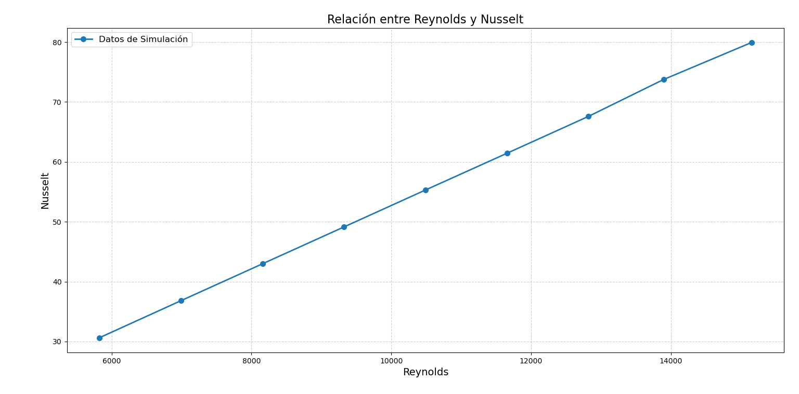
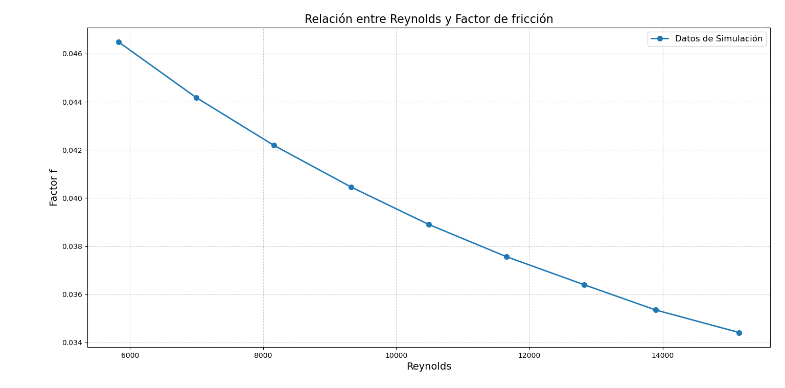

### 🌪️*Graficas de datos en Fluent*🌪️
```python
print("Hola!!!")
print("Este es un código de obtención de Graficos")
print("A partir de datos que obtienes de Fluent")
print("Por medio de simulaciones CFD.")
print("Viva la FÍSICA!!!")
```

## 🔍*Características*
### - Creación de graficos por medio de datos
### - Los Graficos pueden tomar cualquier variable
### - Edición a gusto del usuario de Graficos y variables
### - Visualización y descarga del grafico obtenido
## ⚙*Instalación*
### 1.- Clona el repositorio
### 2.- Instala las dependencias desde tu terminal: 
### pip install numpy matplotlib
### 3.- Ejecuta *Grafics_Workb.py*
## ▶*Cómo usar*
### 4.- Ingresa los datos en cualquiera de las listas (Re o Factor f)
### *Nota: La cantidad de datos ingresados debe ser el mismo en ambas listas*
### 5.- Opcional: Edita las variables o graficos a tu gusto
## 🖼*Capturas*
### Grafico de Reynolds vs Nusselt

### Grafico de Reynolds vs Factor de fricción

## 🛠*Tecnologías utilizadas*
### - Python 3.13.9
### - Numpy
### - Matplotlib
### - Git
### - Github
## 📈*Futuras mejoras*
### - Visualización de distintos tipos de graficos
### - Respuestas automatizadas con base a los datos
### - Combinación de más de dos listas en un grafico
## 📜*Licencia*
## 🗿*Autor*
### Ricardo Brayan Juarez Valencia
